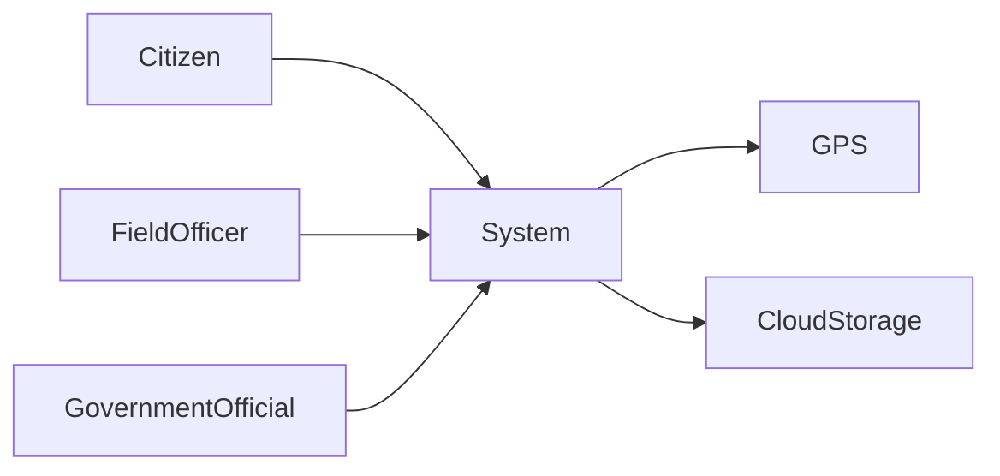
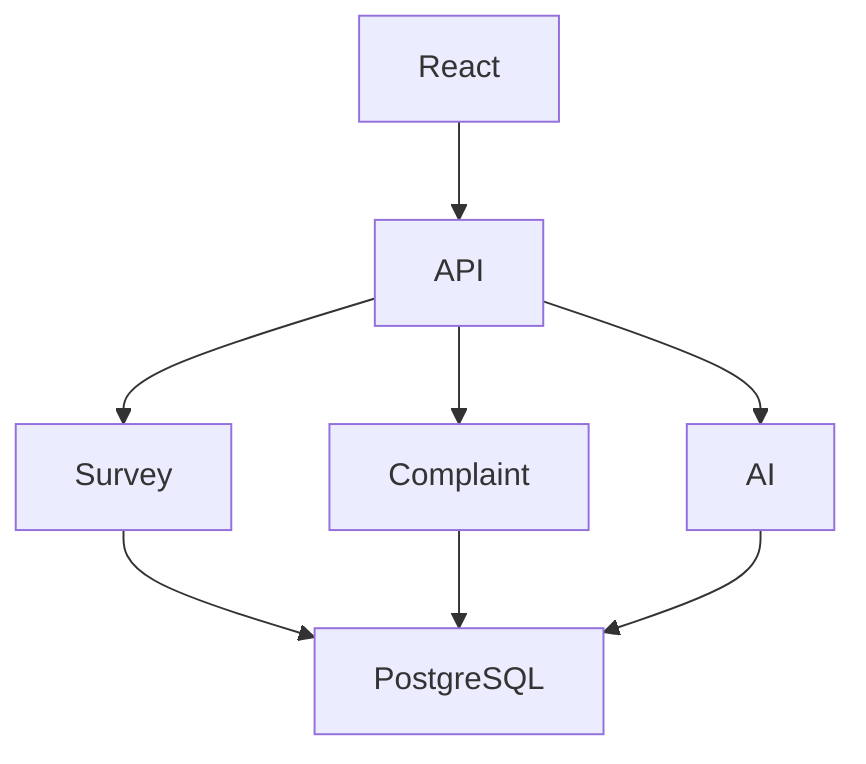
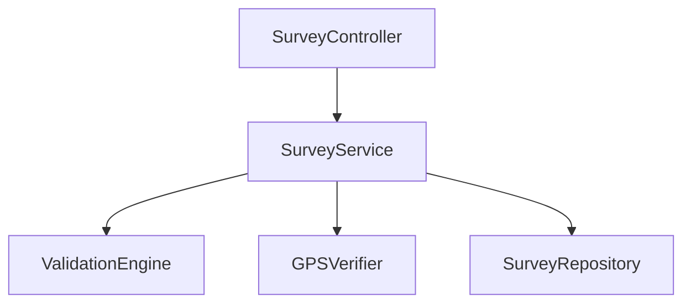
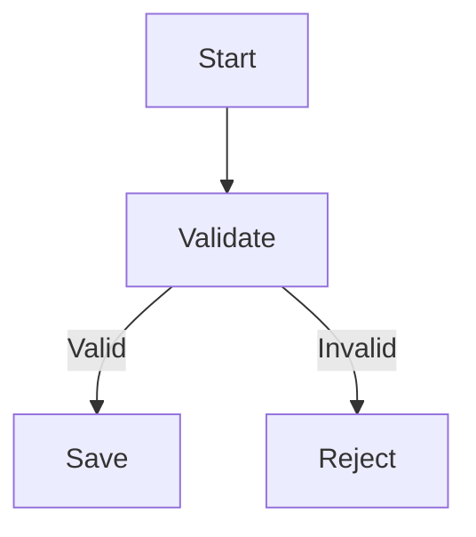
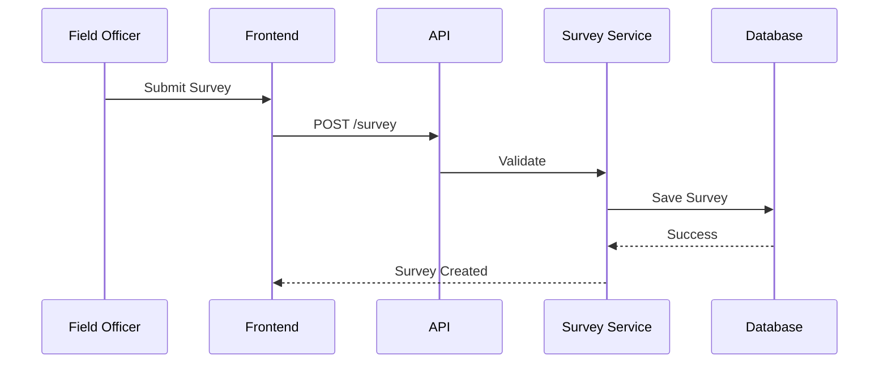

# Diagram_Standards.md

> **Version:** 1.0
> **Status:** Approved
> **Owner:** Architecture Team
> **Project: AI Rural Root Cause Discovery System

---

# Diagram Standards

> **"A diagram should communicate architectural intent, not merely illustrate system components."**

This document defines the official standards for creating, reviewing, and maintaining all architectural diagrams in this repository.

---

# Table of Contents

1. Purpose
2. Diagram Philosophy
3. General Standards
4. Diagram Categories
5. C4 Model Standards
6. Flowchart Standards
7. Sequence Diagram Standards
8. Data Flow Diagram (DFD) Standards
9. Entity Relationship Diagram Standards
10. State Diagram Standards
11. Deployment Diagram Standards
12. Communication Diagram Standards
13. Trust Boundary Diagram Standards
14. AI Pipeline Diagram Standards
15. Failure & Recovery Diagram Standards
16. Diagram Naming Convention
17. Mermaid Guidelines
18. PlantUML Guidelines
19. Common Mistakes
20. Diagram Review Checklist

---

# 1. Purpose

This document establishes a consistent visual language for architecture documentation.

Objectives:

- Improve architectural communication.
- Reduce ambiguity.
- Standardize diagram design.
- Support implementation.
- Support future maintenance.

---

# 2. Diagram Philosophy

Every diagram should answer one primary question.

Examples:

| Diagram | Primary Question |
|----------|------------------|
| Context | Who interacts with the system? |
| Container | How is the system organized? |
| Component | How is one container internally structured? |
| Sequence | What happens over time? |
| Deployment | Where does software execute? |
| DFD | How does information move? |
| ERD | How is data stored? |
| Trust Boundary | Where are security boundaries? |

Avoid diagrams that attempt to answer multiple unrelated questions simultaneously.

---

# 3. General Standards

Every diagram must include:

- Title
- Purpose
- Version
- Diagram Type
- Legend (if required)

Every diagram should be:

- Simple
- Readable
- Consistent
- Self-explanatory
- Focused on one concern

---

# 4. Diagram Categories

The repository uses the following diagram types:

## System Architecture

- Context Diagram
- Container Diagram
- Component Diagram
- Deployment Diagram

## Process Diagrams

- Sequence Diagram
- Activity Diagram
- Flowchart
- State Diagram

## Data Diagrams

- Data Flow Diagram
- Entity Relationship Diagram

## Security Diagrams

- Trust Boundary Diagram
- Authentication Flow
- Authorization Flow

## AI Diagrams

- AI Processing Pipeline
- Recommendation Pipeline
- Evidence Processing Pipeline

## Operations Diagrams

- Monitoring Flow
- Logging Flow
- Failure Recovery
- CI/CD Pipeline

---

# 5. C4 Model Standards

## Level 1 – Context Diagram

Purpose:

Show external actors and the system boundary.

Include:

- Users
- External Systems
- Primary Interactions

Do NOT include:

- Database tables
- Internal APIs
- Source code

Example:



---

## Level 2 – Container Diagram

Purpose:

Show deployable applications and data stores.

Include:

- React Frontend
- API
- AI Service
- PostgreSQL
- Object Storage

Example:



---

## Level 3 – Component Diagram

Purpose:

Describe the internal structure of a container.

Example:



---

# 6. Flowchart Standards

Use flowcharts to document business logic.

Symbols:

- Rectangle → Process
- Diamond → Decision
- Oval → Start/End

Example:



---

# 7. Sequence Diagram Standards

Use sequence diagrams for runtime interactions.

Example:



---

# 8. Data Flow Diagram Standards

Purpose:

Describe how information flows through the system.

Example:

```text
Survey
      ↓
Validation
      ↓
Database
      ↓
AI Pipeline
      ↓
Recommendation
```

---

# 9. Entity Relationship Diagram Standards

Describe logical database relationships.

Example:

```text
Village
   │
   │1
   │
   ├──────────────*
Survey
   │
   ├──────────────*
Evidence

Complaint
   │
   ├──────────────*
Recommendation
```

---

# 10. State Diagram Standards

Use when an entity changes state.

Example:

```text
Draft

↓

Submitted

↓

Validated

↓

Approved

↓

Archived
```

---

# 11. Deployment Diagram Standards

Show infrastructure.

Include:

- Client
- CDN
- Backend
- Database
- Storage
- Monitoring

---

# 12. Communication Diagram Standards

Document:

- REST
- Events
- Queues
- Background Workers

Example:

```text
React

↓

REST API

↓

Survey Service

↓

Message Queue

↓

AI Worker

↓

Recommendation Engine
```

---

# 13. Trust Boundary Diagram Standards

Always identify:

- Public Zone
- DMZ
- Internal Network
- Database Network

Example:

```text
Internet

↓

Frontend

────────────────────────

API Gateway

────────────────────────

Application Services

────────────────────────

Database
```

---

# 14. AI Pipeline Diagram Standards

Every AI workflow should include:

```text
Survey

↓

Validation

↓

Cleaning

↓

Feature Engineering

↓

Similarity Analysis

↓

Root Cause Discovery

↓

Confidence Score

↓

Explainability

↓

Recommendations
```

---

# 15. Failure & Recovery Diagram Standards

Every critical service must define failure handling.

Example:

```text
Survey Save

↓

Database Failure

↓

Retry

↓

Retry Failed

↓

Dead Letter Queue

↓

Administrator Alert
```

---

# 16. Diagram Naming Convention

Use descriptive names.

Examples:

- System_Context_Diagram
- Container_Diagram
- Component_Diagram
- Deployment_Diagram
- Survey_Sequence_Diagram
- AI_Pipeline_Diagram

Avoid:

- Diagram1
- FinalDiagram
- NewFlow
- TestDiagram

---

# 17. Mermaid Guidelines

Preferred syntax:

- `flowchart`
- `sequenceDiagram`
- `classDiagram`
- `stateDiagram-v2`

Guidelines:

- Keep diagrams under ~25 nodes.
- Use consistent direction (`LR` or `TB`) within a document.
- Group related components logically.
- Label arrows with meaningful actions where appropriate.
- Avoid crossing lines when possible.

---

# 18. PlantUML Guidelines

PlantUML may be used for:

- UML Class Diagrams
- Activity Diagrams
- Use Case Diagrams
- Deployment Diagrams

Mermaid remains the preferred default because it renders natively on GitHub.

---

# 19. Common Mistakes

Avoid:

- Overcrowded diagrams
- Inconsistent naming
- Missing arrows
- Crossing connectors
- Mixing abstraction levels
- Unlabeled components
- Decorative colors without meaning

---

# 20. Diagram Review Checklist

## Readability

- [ ] Diagram title included
- [ ] Purpose defined
- [ ] Components labeled
- [ ] Relationships clear

## Consistency

- [ ] Naming conventions followed
- [ ] Standard symbols used
- [ ] Layout consistent

## Technical Quality

- [ ] Security boundaries shown (if applicable)
- [ ] Data flow accurate
- [ ] Dependencies correct
- [ ] Failure paths documented

## Documentation

- [ ] Diagram referenced in the architecture document
- [ ] Version updated
- [ ] Legend included (if required)

---

# Guiding Principle

> **Every diagram should reduce complexity, improve understanding, and enable implementation. If a diagram cannot help a developer, architect, or reviewer make a better decision, it should be simplified or removed.**