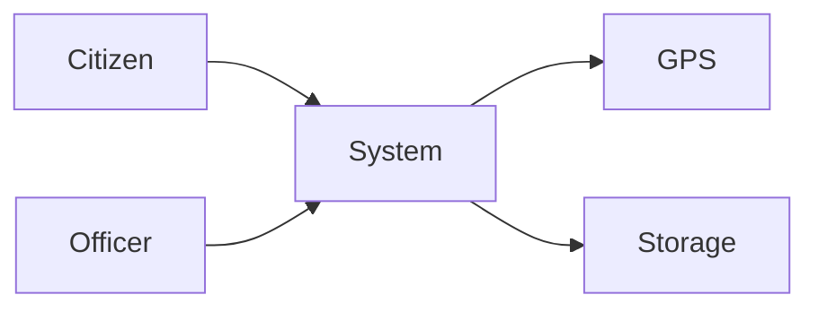
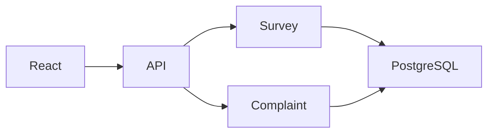

# Mermaid_Style_Guide.md

> **Version:** 1.0
> **Status:** Approved
> **Owner:** Architecture Team

---

# Mermaid Style Guide

> **"Consistency improves readability more than decoration."**

This document defines the official Mermaid standards for all architecture diagrams within the project.

---

# Table of Contents

1. Purpose
2. Supported Diagram Types
3. General Rules
4. Layout Standards
5. Naming Conventions
6. Node Standards
7. Arrow Standards
8. Grouping Standards
9. Labeling Standards
10. Color & Styling Policy
11. Diagram Patterns
12. Examples
13. Anti-Patterns
14. Review Checklist

---

# 1. Purpose

This guide ensures that every Mermaid diagram:

- Looks consistent
- Is easy to understand
- Is GitHub compatible
- Is easy to maintain

---

# 2. Supported Diagram Types

Preferred Mermaid diagrams:

- flowchart
- sequenceDiagram
- classDiagram
- stateDiagram-v2
- erDiagram
- journey
- gitGraph
- gantt (when required)

---

# 3. General Rules

✔ One diagram = One concern

✔ Maximum 25 nodes

✔ Maximum 4 hierarchy levels

✔ Avoid crossing arrows

✔ Left-to-right OR Top-to-bottom

Never mix directions unnecessarily.

---

# 4. Layout Standards

## Preferred Layout

System Level

```mermaid
flowchart LR
```

Business Flow

```mermaid
flowchart TD
```

Sequence

```mermaid
sequenceDiagram
```

Database

```mermaid
erDiagram
```

State Machine

```mermaid
stateDiagram-v2
```

---

# 5. Naming Conventions

## Components

Good

```
Survey Service

Complaint Service

AI Analysis Engine

Authentication API
```

Bad

```
Module1

Backend2

Logic

ServiceA
```

---

## Databases

Good

```
PostgreSQL

SurveyDB

EvidenceStore
```

Bad

```
DB

Data

Storage
```

---

## APIs

Always use

```
REST API

GraphQL API

Authentication API
```

Avoid

```
Backend

Server

API Stuff
```

---

# 6. Node Standards

External Actors

```
Citizen

Field Officer

Government Official
```

Containers

```
Frontend

API

Survey Service

Complaint Service

AI Engine
```

Infrastructure

```
PostgreSQL

Redis

Object Storage

Monitoring
```

---

# 7. Arrow Standards

Use verbs whenever possible.

Good

```
Submit Survey

Authenticates

Stores

Publishes Event

Reads Evidence

Returns Recommendation
```

Bad

```
Data

Go

Next

Run
```

---

# 8. Grouping Standards

Group related components using subgraphs.

Example

```mermaid
flowchart TB

subgraph Client

React

end

subgraph Backend

API

Survey Service

Complaint Service

end

subgraph Data

PostgreSQL

Object Storage

end
```

---

# 9. Labeling Standards

Every important relationship should explain its purpose.

Good

```
POST /survey

Validates JWT

Stores Evidence

Reads Survey
```

Avoid unlabeled arrows where the interaction is not obvious.

---

# 10. Color & Styling Policy

GitHub renders Mermaid differently across themes.

Therefore:

✔ Use default Mermaid styling.

Avoid:

- Custom colors
- Theme overrides
- CSS injections

The focus is architectural clarity, not visual decoration.

---

# 11. Diagram Patterns

## System Context



---

## Container



---

## Component

```mermaid
flowchart TD

Controller

↓

Service

↓

Validator

↓

Repository
```

---

## AI Pipeline

```mermaid
flowchart TD

Survey

↓

Validation

↓

Cleaning

↓

Feature Engineering

↓

Similarity Analysis

↓

Root Cause Detection

↓

Recommendation

↓

Dashboard
```

---

## Failure Flow

```mermaid
flowchart TD

Save Survey

↓

Database Failure

↓

Retry

↓

Dead Letter Queue

↓

Administrator Alert
```

---

# 12. Reusable Templates

Every new diagram should start from one of these templates:

- Context Template
- Container Template
- Component Template
- Sequence Template
- Deployment Template
- AI Pipeline Template
- Failure Template

---

# 13. Anti-Patterns

Do NOT:

❌ Mix business flow and deployment in one diagram

❌ Draw databases as services

❌ Cross trust boundaries without labels

❌ Create diagrams with >25 nodes

❌ Use abbreviations without explanation

❌ Mix implementation details into Context diagrams

---

# 14. Architecture Review Checklist

## Structure

- [ ] Correct Mermaid type used
- [ ] Proper layout direction
- [ ] Diagram title included

## Readability

- [ ] Components clearly named
- [ ] Relationships labeled
- [ ] Logical grouping applied

## Consistency

- [ ] Naming conventions followed
- [ ] Standard templates used
- [ ] GitHub compatible

## Quality

- [ ] Supports the architecture document
- [ ] Easy to understand
- [ ] No unnecessary complexity

---

# Guiding Principle

> **Mermaid diagrams are engineering communication tools. Every diagram should be simple enough to understand in under 30 seconds, yet detailed enough to guide implementation. Favor clarity over completeness and consistency over creativity.**