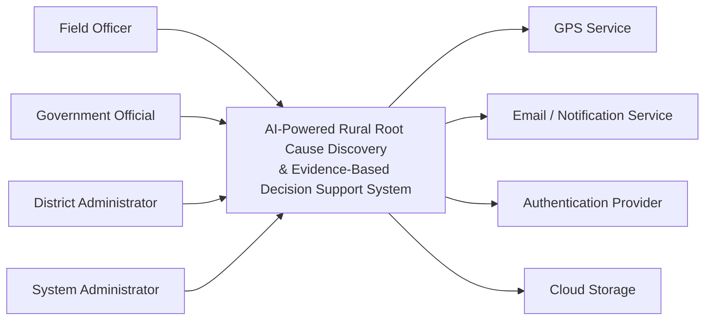

# 🌐 System Context Diagram

Version: 1.0

Project: AI Rural Root Cause Discovery System

Status:
Approved

---

# Purpose

The System Context Diagram defines the system's boundaries and illustrates how it interacts with external users and external systems.

It provides a high-level view of the ecosystem in which the application operates without exposing internal implementation details.

This document follows the **C4 Model – Level 1 (System Context)**.

---

# Scope

This document describes:

- System boundary
- Primary actors
- External systems
- High-level interactions
- Trust boundaries

It intentionally excludes internal architecture, services, and database design.

---

# System Overview

The AI-Powered Rural Root Cause Discovery & Evidence-Based Decision Support System enables government agencies to collect, validate, analyze, and visualize rural survey information to support evidence-based administrative decisions.

The system acts as a centralized platform that combines field data, geographical information, complaints, and AI-driven analysis into explainable recommendations.

---

# Primary Actors

## Field Officer

Responsibilities:

- Conduct rural surveys
- Capture GPS locations
- Upload supporting photographs
- Record citizen complaints
- Submit field data

---

## Government Official

Responsibilities:

- Review dashboards
- Analyze AI recommendations
- Investigate evidence
- Make administrative decisions

---

## District Administrator

Responsibilities:

- Monitor district-wide trends
- Generate reports
- Review performance indicators
- Supervise field operations

---

## System Administrator

Responsibilities:

- Manage users
- Configure the system
- Monitor security
- Review audit logs
- Maintain system availability

---

# External Systems

## GPS Services

Provides geographic coordinates used during survey collection.

Interaction:

- Receive device coordinates
- Validate survey locations

---

## Email / Notification Service

Used for:

- Account notifications
- Password reset
- Administrative alerts

---

## Authentication Provider

Responsible for verifying user identity and issuing authentication tokens.

---

## Cloud Storage (Optional)

Stores uploaded evidence such as:

- Images
- Documents
- Supporting files

---

# System Boundary

The following capabilities are inside the system boundary:

- Authentication
- Survey Management
- Complaint Management
- Evidence Management
- AI Analysis
- Root Cause Discovery
- Reporting
- Dashboard
- Audit Logging

The following are outside the system boundary:

- GPS infrastructure
- Email infrastructure
- Internet connectivity
- Government policy decisions
- Mobile device hardware

---

# C4 Level 1 – System Context Diagram

---

# Trust Boundaries

## Trusted Zone

- Backend Services
- Database
- AI Engine
- Audit Logs

---

## Semi-Trusted Zone

- Web Browser
- Mobile Browser
- Authenticated Users

---

## External Zone

- GPS Services
- Email Services
- Cloud Storage
- Internet

---

# High-Level Interaction Flow

1. Field Officer submits survey.
2. System validates information.
3. GPS coordinates are recorded.
4. Evidence is stored.
5. AI analyzes collected information.
6. Government officials review recommendations.
7. Administrators generate reports.
8. Audit logs capture significant events.

---

# Security Considerations

The context-level architecture enforces:

- HTTPS communication
- Authentication before protected actions
- Role-based authorization
- Secure integration with external services
- Audit logging of administrative actions

---

# Design Decisions

| Decision | Rationale |
|----------|-----------|
| Centralized platform | Simplifies governance and reporting |
| External GPS service | Avoids maintaining location infrastructure |
| External notification service | Improves reliability and maintainability |
| Modular backend | Enables future scalability |

---

# Requirement Traceability

This document supports:

- FR-001 – Authentication
- FR-004 – Survey Management
- FR-018 – AI Analysis
- FR-022 – Dashboard
- FR-024 – Reporting
- NFR – Security
- NFR – Availability
- NFR – Scalability

---

# Future Enhancements

Potential future integrations include:

- GIS platforms
- SMS gateways
- State-level government systems
- Open government data portals
- Mobile applications

---

# References

- C4 Model
- Architecture Overview
- Requirements Traceability Matrix
- Security Architecture

---

# Guiding Principle

The System Context Diagram defines the environment in which the system operates, ensuring clear boundaries between internal responsibilities and external dependencies.