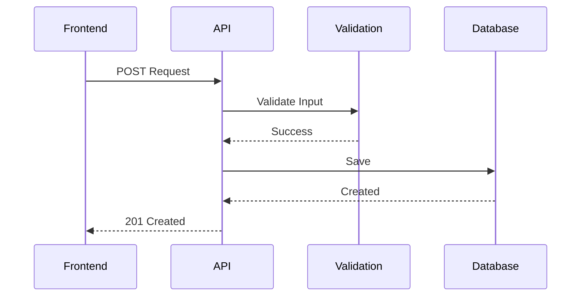

# API_Documentation_Template.md

> **Version:** 1.0
> **Status:** Template
> **Owner:** Architecture Team
> **Applies To:** All REST APIs within the project

---

# Purpose

This template standardizes the documentation of all REST APIs used in the system.

Every API must be documented using this format to ensure:

- Consistency
- Maintainability
- Implementation Readiness
- Testability
- Security Compliance

---

# Template

# <API Name>

> Version:
> Status:
> Owner:
> Base URL:
> API Version:

---

# 1. Purpose

Describe the business capability exposed by this API.

Questions:

- Why does this API exist?
- Which business process does it support?
- Who consumes this API?

---

# 2. Scope

Included

-

-

Excluded

-

-

---

# 3. API Summary

| Property | Value |
|-----------|-------|
| API Name | |
| Version | |
| Protocol | REST |
| Format | JSON |
| Authentication | JWT |
| Authorization | RBAC |
| Owner | |
| Status | |

---

# 4. Consumers

| Consumer | Purpose |
|----------|---------|
| React Frontend | |
| Mobile App | |
| AI Service | |
| Reporting Module | |

---

# 5. Endpoints

## POST

| Endpoint | Description |
|----------|-------------|
| /api/v1/... | |

---

## GET

| Endpoint | Description |
|----------|-------------|
| /api/v1/... | |

---

## PUT

| Endpoint | Description |
|----------|-------------|
| /api/v1/... | |

---

## DELETE

| Endpoint | Description |
|----------|-------------|
| /api/v1/... | |

---

# 6. Request Format

## Headers

Authorization

Content-Type

Accept

Correlation-ID

Example

```http
POST /api/v1/surveys
Authorization: Bearer <JWT>
Content-Type: application/json
```

---

## Request Body

```json
{
  "villageId": "",
  "category": "",
  "description": ""
}
```

Field descriptions:

| Field | Type | Required | Description |
|--------|------|----------|-------------|
| villageId | UUID | Yes | |
| category | String | Yes | |
| description | String | Yes | |

---

# 7. Response Format

## Success

```json
{
  "success": true,
  "message": "Survey created",
  "data": {}
}
```

---

## Error

```json
{
  "success": false,
  "errorCode": "VALIDATION_ERROR",
  "message": "Invalid village ID"
}
```

---

# 8. HTTP Status Codes

| Code | Meaning |
|------|---------|
| 200 | OK |
| 201 | Created |
| 400 | Bad Request |
| 401 | Unauthorized |
| 403 | Forbidden |
| 404 | Not Found |
| 409 | Conflict |
| 422 | Validation Error |
| 500 | Internal Server Error |

---

# 9. Validation Rules

Input Validation

Business Validation

Duplicate Checks

Data Constraints

---

# 10. Authentication

Authentication Method

JWT Validation

Token Expiry

Refresh Strategy

---

# 11. Authorization

Allowed Roles

Role Permissions

RBAC Matrix

---

# 12. Workflow



---

# 13. Error Handling

| Error | Cause | Response |
|--------|-------|----------|
| Validation Error | Invalid Input | 400 |
| Unauthorized | Missing JWT | 401 |
| Forbidden | RBAC Failure | 403 |
| Duplicate | Existing Record | 409 |

---

# 14. Security Controls

JWT

RBAC

HTTPS

Rate Limiting

Audit Logging

Input Sanitization

Output Encoding

---

# 15. Performance Targets

| Metric | Target |
|---------|--------|
| Response Time | <500 ms |
| Availability | 99.9% |
| Throughput | TBD |

---

# 16. Rate Limiting

Requests per minute

Burst Limits

Abuse Protection

---

# 17. API Versioning

Current Version

Deprecation Policy

Migration Strategy

---

# 18. Logging

Request Logs

Error Logs

Audit Logs

Performance Logs

---

# 19. Monitoring

Latency

Error Rate

Availability

Traffic

---

# 20. Testing

Unit Tests

Integration Tests

Contract Tests

Security Tests

Performance Tests

---

# 21. OpenAPI Mapping

Swagger Specification

OpenAPI Version

Example YAML

---

# 22. Requirement Traceability

| Requirement | Coverage |
|-------------|----------|
| FR | |
| NFR | |
| BR | |

---

# 23. Developer Notes

Controller

Service

Repository

DTO

Validation Classes

Exception Handler

---

# 24. Review Checklist

## Design

- [ ] RESTful Design
- [ ] Proper Naming
- [ ] Resource-Oriented

## Security

- [ ] JWT
- [ ] RBAC
- [ ] HTTPS
- [ ] Validation

## Documentation

- [ ] Examples Included
- [ ] Status Codes Complete
- [ ] Workflow Diagram Included

## Quality

- [ ] OpenAPI Ready
- [ ] Testable
- [ ] Versioned

---

# Guiding Principle

> **Every API should expose a clear business capability, follow REST principles, validate all inputs, enforce security consistently, return predictable responses, and be fully documented so that frontend, backend, and integration developers can implement against it with confidence.**