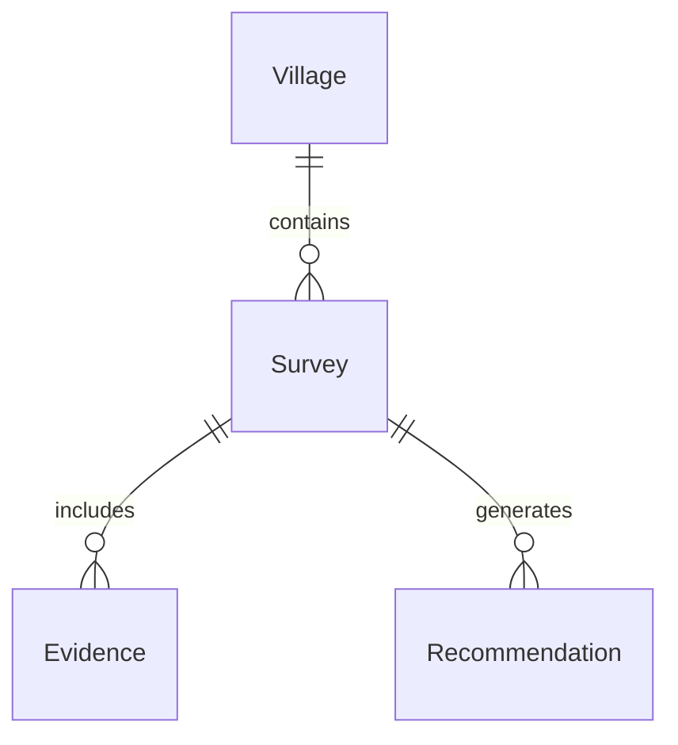

# Database_Documentation_Template.md

> **Version:** 1.0
> **Status:** Template
> **Owner:** Architecture Team
> **Applies To:** All databases, schemas, tables, and persistent storage within the project.

---

# Purpose

This template standardizes the documentation of all database structures, ensuring consistency, integrity, scalability, and maintainability across the project.

It serves as the authoritative reference for database architecture, schema evolution, data ownership, constraints, and operational practices.

---

# Table of Contents

1. Database Overview
2. Business Purpose
3. Technology Stack
4. Schema Overview
5. Data Ownership
6. Tables
7. Relationships
8. Constraints
9. Index Strategy
10. Views
11. Stored Procedures
12. Transactions
13. Data Lifecycle
14. Migration Strategy
15. Backup & Recovery
16. Security
17. Performance
18. Monitoring
19. Failure Recovery
20. Data Governance
21. Review Checklist

---

# Database Overview

| Property | Value |
|-----------|-------|
| Database Name | |
| Database Type | PostgreSQL |
| Version | |
| Owner | |
| Environment | Development / Testing / Production |
| Availability Target | |
| Backup Frequency | |

---

# Business Purpose

Describe:

- Why this database exists
- What business capability it supports
- Which services depend on it
- Critical business data stored

---

# Technology Stack

Database Engine

Storage Engine

ORM

Migration Tool

Backup Tool

Replication

Connection Pool

---

# Schema Overview

Schemas:

- public
- survey
- complaint
- ai
- analytics
- audit

Purpose of each schema.

---

# Data Ownership

| Table | Owner Service |
|---------|---------------|
| Surveys | Survey Service |
| Complaints | Complaint Service |
| Recommendations | AI Service |
| Audit Logs | Authentication Service |

---

# Tables

## Table Name

### Purpose

Describe why the table exists.

### Columns

| Column | Type | Nullable | Description |
|----------|------|----------|-------------|
| id | UUID | No | Primary Key |
| created_at | Timestamp | No | Creation Time |

---

### Primary Key

-

---

### Foreign Keys

-

---

### Unique Constraints

-

---

### Check Constraints

-

---

### Default Values

-

---

### Business Rules

-

---

# Relationships

Describe relationships.

Example

Village

↓

Survey

↓

Evidence

↓

Recommendation

---

# ER Diagram

---

# Index Strategy

| Index | Purpose |
|---------|----------|
| PK | Primary Lookup |
| FK | Join Performance |
| Composite | Reporting |
| Full Text | Search |

---

# Views

Document every database view.

Purpose

Columns

Consumers

Refresh Strategy

---

# Stored Procedures

Procedure

Purpose

Inputs

Outputs

Side Effects

---

# Transactions

Document transaction boundaries.

Atomic Operations

Rollback Rules

Isolation Level

Deadlock Strategy

---

# Data Lifecycle

Creation

↓

Validation

↓

Usage

↓

Archive

↓

Deletion

---

# Data Retention

| Data Type | Retention |
|------------|-----------|
| Survey | |
| Complaint | |
| Audit | |
| Logs | |

---

# Migration Strategy

Migration Tool

Naming Convention

Rollback Process

Versioning

Deployment Strategy

---

# Backup Strategy

Backup Type

Frequency

Retention

Storage

Recovery Objective

---

# Disaster Recovery

Recovery Time Objective (RTO)

Recovery Point Objective (RPO)

Failover Strategy

Replication

---

# Security

Authentication

Authorization

Encryption at Rest

Encryption in Transit

Secrets

Database Roles

Least Privilege

---

# Performance

Connection Pool

Caching

Query Optimization

Partitioning

Vacuum Strategy

Statistics

---

# Monitoring

Slow Queries

CPU

Memory

Connections

Locks

Replication Lag

---

# Failure Recovery

Database Failure

↓

Retry

↓

Failover

↓

Recovery

↓

Verification

---

# Audit Logging

Track:

INSERT

UPDATE

DELETE

Schema Changes

Privilege Changes

---

# Compliance

Data Privacy

Retention Policy

Sensitive Data

PII Handling

Audit Requirements

---

# Scalability

Vertical Scaling

Horizontal Scaling

Read Replicas

Partitioning

Sharding Strategy

Future Expansion

---

# Risks

Data Loss

Corruption

Lock Contention

Replication Failure

Migration Failure

---

# Requirement Traceability

| Requirement | Coverage |
|-------------|----------|
| FR | |
| NFR | |
| BR | |

---

# Developer Notes

Naming Standards

Migration Guidelines

Coding Standards

ORM Mapping

Testing Strategy

---

# Review Checklist

## Design

- [ ] Normalization Reviewed
- [ ] Relationships Validated
- [ ] Naming Standards Followed

## Security

- [ ] Least Privilege
- [ ] Encryption Enabled
- [ ] Audit Logging Configured

## Performance

- [ ] Indexes Reviewed
- [ ] Query Performance Tested
- [ ] Backup Strategy Verified

## Documentation

- [ ] ER Diagram Included
- [ ] Data Ownership Defined
- [ ] Migration Strategy Documented

---

# Guiding Principle

> **The database is the system's source of truth. Every schema, table, relationship, and constraint should be designed to preserve data integrity, support business processes, scale with demand, and remain understandable throughout the system's lifecycle.**