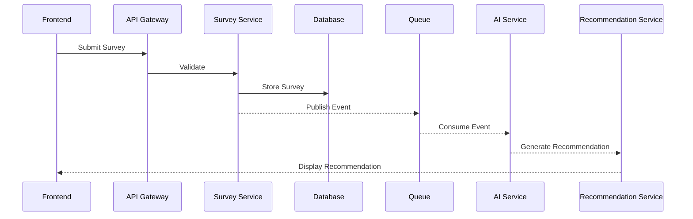

# Integration_Architecture_Template.md

> **Version:** 1.0
> **Status:** Template
> **Owner:** Integration Architecture Team
> **Applies To:** Internal services, external systems, APIs, event-driven integrations, messaging platforms, and third-party services.

---

# Purpose

This template standardizes the documentation of system integrations.

It ensures all integrations are:

- Reliable
- Secure
- Observable
- Versioned
- Resilient
- Maintainable

---

# Table of Contents

1. Integration Overview
2. Business Objectives
3. Integration Principles
4. Integration Landscape
5. Integration Inventory
6. Communication Patterns
7. Internal Integrations
8. External Integrations
9. API Integrations
10. Event-Driven Integrations
11. Messaging Architecture
12. Data Transformation
13. Authentication & Authorization
14. Reliability Patterns
15. Error Handling
16. Monitoring
17. Versioning
18. Risks
19. Review Checklist

---

# Integration Overview

| Property | Value |
|-----------|-------|
| Integration Name | |
| Owner | |
| Version | |
| Pattern | |
| Criticality | |

---

# Business Objectives

Examples

- Exchange data
- Synchronize services
- Reduce coupling
- Enable automation
- Improve scalability
- Integrate external systems

---

# Integration Principles

- Loose Coupling
- Contract First
- Event Driven
- Idempotency
- Retry with Backoff
- Security by Default
- Observability

---

# High-Level Integration Architecture

```text
Frontend

↓

API Gateway

↓

Internal Services

↓

Message Queue

↓

AI Services

↓

External APIs

↓

Government Systems
```

---

# Integration Inventory

| Integration | Type | Direction | Criticality |
|-------------|------|-----------|-------------|
| Survey API | REST | Internal | High |
| AI Engine | REST | Internal | High |
| SMS Gateway | REST | External | Medium |
| Email Service | REST | External | Medium |

---

# Communication Patterns

Supported Patterns

- REST
- GraphQL
- gRPC
- Message Queue
- Event Streaming
- Webhooks
- Batch Processing

Document why each pattern is selected.

---

# Internal Integrations

Document:

Producer

Consumer

Protocol

Authentication

Payload

Version

---

# External Integrations

Document:

Provider

Purpose

Authentication

Rate Limits

Retry Strategy

Fallback

SLA

---

# API Integration

Document

Endpoint

Method

Headers

Payload

Response

Timeout

Version

---

# Event-Driven Integration

Example

```text
Survey Created

↓

Message Queue

↓

AI Service

↓

Recommendation Created

↓

Notification Service
```

---

# Messaging Architecture

Queue Name

Topic

Consumer Group

Retention

Ordering

Dead Letter Queue

Acknowledgement Strategy

---

# Integration Sequence



---

# Data Transformation

Validation

Mapping

Normalization

Enrichment

Filtering

Serialization

Compression

---

# Authentication

JWT

OAuth2

API Keys

mTLS

Certificates

Secrets

---

# Authorization

Service Roles

Scopes

Policies

Permission Matrix

---

# Reliability Patterns

Retry

Exponential Backoff

Circuit Breaker

Bulkhead

Timeout

Fallback

Compensation

---

# Error Handling

Validation Errors

Timeouts

Connection Failures

Rate Limits

Duplicate Messages

Poison Messages

Dead Letter Queue

---

# Idempotency

Idempotency Keys

Duplicate Detection

Safe Retry Rules

Replay Handling

---

# Transaction Strategy

Synchronous Transactions

Asynchronous Transactions

Saga Pattern

Compensation Workflow

---

# Monitoring

Integration Health

Latency

Error Rate

Queue Depth

Retry Count

Consumer Lag

Availability

---

# Logging

Request Logs

Response Logs

Event Logs

Audit Logs

Correlation IDs

Distributed Tracing

---

# Performance

Latency

Throughput

Payload Size

Connection Pool

Concurrency

Rate Limits

---

# Security

Encryption in Transit

Message Signing

Input Validation

Output Validation

Replay Protection

Secret Rotation

---

# Versioning

API Version

Event Version

Backward Compatibility

Deprecation Policy

Migration Plan

---

# Third-Party Dependency Management

Dependency Owner

SLA

Availability

Fallback Provider

Maintenance Window

---

# Risks

| Risk | Impact | Mitigation |
|------|--------|------------|
| External API Failure | | |
| Queue Failure | | |
| Contract Change | | |
| Rate Limit | | |
| Duplicate Events | | |

---

# Requirement Traceability

| Requirement | Coverage |
|-------------|----------|
| FR | |
| NFR | |
| Integration | |

---

# Review Checklist

## Architecture

- [ ] Communication Pattern Selected
- [ ] Contracts Defined
- [ ] Data Mapping Documented

## Reliability

- [ ] Retry Strategy
- [ ] Circuit Breaker
- [ ] Idempotency

## Security

- [ ] Authentication
- [ ] Authorization
- [ ] Encryption

## Operations

- [ ] Monitoring
- [ ] Logging
- [ ] Alerting

## Documentation

- [ ] Sequence Diagram Included
- [ ] Integration Inventory Updated
- [ ] Versioning Strategy Defined

---

# Guiding Principle

> **Integrations should be loosely coupled, contract-driven, secure, resilient, and observable. Every interaction between systems should be designed to tolerate failures gracefully, maintain data consistency, and evolve through versioned interfaces without disrupting dependent services.**