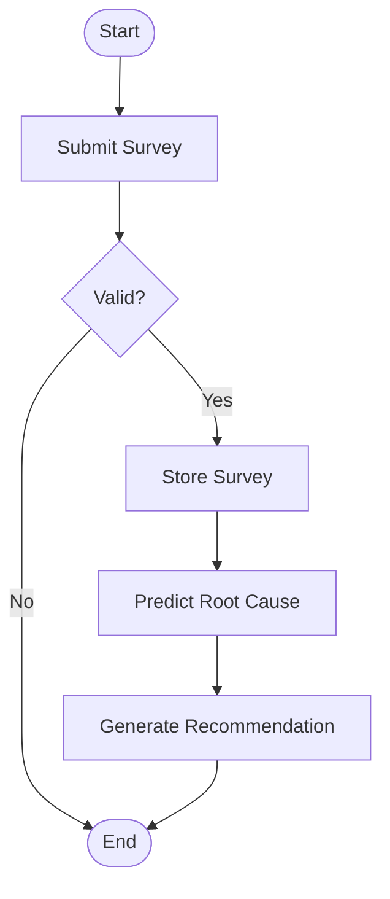

# Activity_Diagram_Template.md

> **Document Version:** 1.0
> **Status:** Draft / Review /Approved
> **Owner:** System Design Team
> **Related Requirements:** [Requirement IDs]
> **Related Architecture:** [Architecture Documents]
> **Last Updated:** YYYY-MM-DD

---

# Activity Diagram Design

---

# Document Information

| Field | Value |
|---------|---------|
| Project | |
| Workflow | |
| Diagram ID | |
| Author | |
| Reviewer | |
| Version | |
| Status | |
| Date | |

---

# Purpose

Describe the workflow represented by this activity diagram.

Include:

- Business objective
- Technical objective
- Process being modeled
- Expected outcome

---

# Scope

## Included

-

-

-

## Excluded

-

-

-

---

# Related Requirements

| ID | Description |
|----|-------------|
| BR-001 | |
| FR-001 | |
| NFR-001 | |

---

# Architecture References

Reference:

- Business Process Design
- Backend Design
- API Design
- AI Component Design
- Security Architecture
- ADRs

---

# Workflow Description

Provide a high-level explanation of the workflow.

Example

```
Citizen submits survey

↓

System validates input

↓

Survey stored

↓

AI predicts root causes

↓

Recommendations generated

↓

Results returned
```

---

# Workflow Objectives

Document:

- Business goal
- System goal
- Success criteria

---

# Actors

| Actor | Responsibility |
|---------|---------------|
| Citizen | |
| Frontend | |
| Backend | |
| AI Service | |
| Database | |

---

# Preconditions

Document conditions that must be true before execution.

Example

- User authenticated
- Required data available
- API operational

---

# Trigger

Describe the event that starts the workflow.

Example

```
User submits survey
```

---

# Main Workflow

Describe each activity.

| Step | Activity | Owner |
|------|----------|------|
|1|Receive request|Frontend|
|2|Validate input|Backend|
|3|Store survey|Database|
|4|Predict causes|AI|
|5|Generate response|Backend|

---

# Decision Points

Document all decisions.

| Decision | Condition | Outcome |
|-----------|-----------|---------|
|Input Valid?|Yes|Continue|
||No|Return Validation Error|

---

# Parallel Activities

Document activities that execute concurrently.

Example

```
Save Survey
      │
      ├──────────────┐
      ▼              ▼
Audit Log      Notification
      │              │
      └──────┬───────┘
             ▼
      Continue Workflow
```

---

# Loop Activities

Document iterative processes.

Example

```
Retry Request

↓

Maximum Retry Reached?

↓

No

↓

Retry

↓

Yes

↓

Failure
```

---

# Exception Flows

Document exceptional scenarios.

Examples

- Validation failure
- Authentication failure
- Database unavailable
- AI inference timeout
- External API unavailable

---

# Postconditions

Describe the final system state.

Examples

- Survey stored
- Recommendation created
- Notification sent
- Audit log written

---

# Swimlanes

Document responsibilities by participant.

| Swimlane | Responsibility |
|-----------|---------------|
| User | |
| Frontend | |
| Backend | |
| Database | |
| AI Service | |

---

# Activity Diagram

Insert Mermaid or PlantUML.

## Mermaid Example



---

# Business Rules

Document rules applied during execution.

| Rule ID | Description |
|----------|-------------|
| BR-001 | |

---

# Data Flow

Document major data movement.

```
User Input

↓

Validation

↓

Database

↓

AI Processing

↓

Recommendation

↓

Response
```

---

# Synchronization

Document:

- Parallel execution
- Merge points
- Join points
- Synchronization requirements

---

# Error Handling

Document:

- Validation failures
- Timeout handling
- Retry strategy
- Recovery actions
- User notifications

---

# Security Considerations

Document:

- Authentication
- Authorization
- Sensitive data handling
- Audit logging

---

# Performance Considerations

Document:

- Workflow latency
- Parallel execution
- Bottlenecks
- Optimization opportunities

---

# Logging

Log important workflow events.

Examples

- Workflow started
- Validation completed
- AI prediction completed
- Workflow failed
- Workflow completed

---

# Monitoring

Track:

- Workflow duration
- Failure rate
- Success rate
- Retry count
- Queue depth

---

# Dependencies

## Internal

-

-

-

## External

-

-

-

---

# Assumptions

-

-

-

---

# Constraints

-

-

-

---

# Risks

| Risk | Mitigation |
|------|------------|
| | |

---

# Traceability

| Requirement | Activity |
|-------------|----------|
| FR-001 | Validate Survey |

---

# References

- Requirements
- Backend Design
- API Design
- AI Component Design
- Sequence Diagram
- ADRs

---

# Review Checklist

## Workflow

- [ ] Activities Defined
- [ ] Decision Points Included
- [ ] Parallel Activities Documented
- [ ] Exception Flows Covered

## Quality

- [ ] Business Rules Included
- [ ] Error Handling Covered
- [ ] Performance Considered
- [ ] Security Reviewed

## Documentation

- [ ] Diagram Validated
- [ ] Requirements Linked
- [ ] Architecture References Added

## Review

- [ ] Reviewed
- [ ] Approved

---

# Revision History

| Version | Date | Description | Author |
|----------|------|-------------|--------|
| 1.0 | YYYY-MM-DD | Initial Version | |