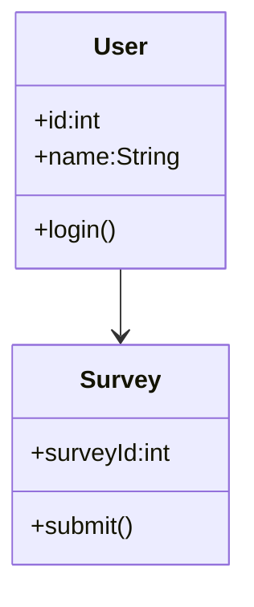

# Class_Diagram_Template.md

> **Document Version:** 1.0
> **Status:** Draft / Review / Approved
> **Owner:** System Design Team
> **Related Requirements:** [Requirement IDs]
> **Related Architecture:** [Architecture Documents]
> **Last Updated:** YYYY-MM-DD

---

# Class Diagram Design

---

# Document Information

| Field | Value |
|---------|---------|
| Project | |
| Module | |
| Diagram ID | |
| Author | |
| Reviewer | |
| Version | |
| Status | |
| Date | |

---

# Purpose

Describe the purpose of this class diagram.

Include:

- Business objective
- Technical objective
- Domain being modeled
- Expected implementation outcome

---

# Scope

## Included

-

-

-

## Excluded

-

-

-

---

# Related Requirements

| ID | Description |
|----|-------------|
| BR-001 | |
| FR-001 | |
| NFR-001 | |

---

# Architecture References

Reference:

- Backend Design
- Database Design
- API Design
- AI Component Design
- ADRs

---

# Domain Overview

Describe the business domain represented.

Example

```
Citizen Management

Survey Management

Recommendation Engine

Analytics
```

---

# Package Organization

Document package structure.

```text
domain/

services/

repositories/

entities/

dto/

events/

exceptions/

interfaces/

utilities/
```

---

# Classes

For every class include:

## Class Name

### Purpose

### Responsibilities

### Attributes

| Name | Type | Visibility |
|------|------|------------|

### Methods

| Method | Return Type | Description |
|---------|-------------|-------------|

### Dependencies

### Notes

---

# Interfaces

Document all interfaces.

| Interface | Purpose |
|-----------|----------|
| IRepository | |
| ILogger | |
| INotificationService | |

---

# Enumerations

Document all enums.

| Enum | Values |
|------|--------|
| SurveyStatus | Pending, Approved, Rejected |

---

# Relationships

Document relationships.

| Source | Relationship | Target |
|----------|-------------|---------|
| User | Association | Survey |
| Survey | Composition | Question |
| Service | Dependency | Repository |

---

# Multiplicity

Document cardinality.

Examples

```
1..1

1..*

0..1

0..*
```

---

# Inheritance Hierarchy

Document inheritance tree.

Example

```
Person

├── Citizen

├── Officer

└── Administrator
```

---

# Composition & Aggregation

Document ownership relationships.

Example

```
Survey

↓

Questions

↓

Responses
```

---

# Dependency Graph

Document major dependencies.

```
Controller

↓

Service

↓

Repository

↓

Database
```

---

# Class Diagram

Insert Mermaid or PlantUML.

## Mermaid Example



---

# Design Principles Applied

Document applicable principles.

Examples

- SOLID
- DRY
- KISS
- Dependency Injection
- Composition over Inheritance

---

# Constraints

Document:

- Business constraints
- Technical constraints
- Domain constraints

---

# Assumptions

-

-

-

---

# Error Handling

Document object-level validation.

Examples

- Invalid state transitions
- Null handling
- Domain validation

---

# Persistence Mapping

Document mapping to database.

| Class | Table |
|--------|-------|
| User | users |
| Survey | surveys |

---

# Serialization

Document serialization strategy.

Examples

- JSON
- XML
- Protobuf

---

# Security Considerations

Document:

- Sensitive fields
- Access modifiers
- Immutable objects
- Secure data handling

---

# Performance Considerations

Document:

- Lazy loading
- Eager loading
- Object creation
- Memory usage

---

# Logging

Document object lifecycle events.

Examples

- Entity created
- Entity updated
- Entity deleted

---

# Monitoring

Track:

- Object creation rate
- Memory consumption
- Cache hit ratio

---

# Dependencies

## Internal

-

-

-

## External

-

-

-

---

# Risks

| Risk | Mitigation |
|------|------------|
| | |

---

# Traceability

| Requirement | Class |
|-------------|-------|
| FR-001 | SurveyService |

---

# References

- Requirements
- Backend Design
- Database Design
- API Design
- Sequence Diagram
- ADRs

---

# Review Checklist

## Modeling

- [ ] Classes Defined
- [ ] Responsibilities Clear
- [ ] Relationships Accurate
- [ ] Multiplicity Specified

## Design

- [ ] SOLID Principles Applied
- [ ] Dependencies Reviewed
- [ ] Interfaces Defined
- [ ] Domain Model Complete

## Quality

- [ ] Error Handling Covered
- [ ] Security Reviewed
- [ ] Performance Considered

## Documentation

- [ ] Diagram Validated
- [ ] Requirements Linked
- [ ] Architecture References Added

## Review

- [ ] Reviewed
- [ ] Approved

---

# Revision History

| Version | Date | Description | Author |
|----------|------|-------------|--------|
| 1.0 | YYYY-MM-DD | Initial Version | |