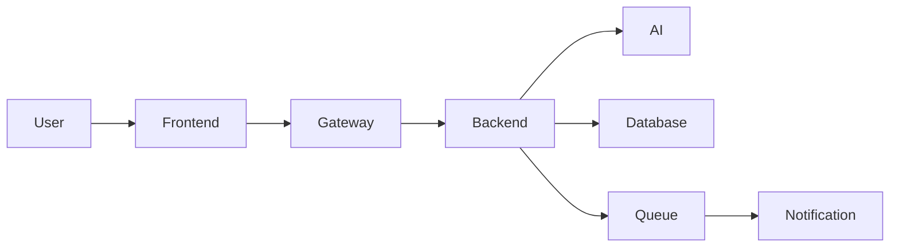

# Component_Interaction_Template.md

> **Document Version:** 1.0
> **Status:** Draft / Review / Approved
> **Owner:** System Architecture Team
> **Related Requirements:** [Requirement IDs]
> **Related Architecture:** [Architecture Documents]
> **Last Updated:** YYYY-MM-DD

---

# Component Interaction Design

---

# Document Information

| Field | Value |
|---------|---------|
| Project | |
| Module | |
| Interaction Scope | |
| Author | |
| Reviewer | |
| Version | |
| Status | |
| Date | |

---

# Purpose

Describe the purpose of this document.

Include:

- Business objective
- Technical objective
- Interaction scope
- Expected outcomes

---

# Scope

## Included

-

-

-

## Excluded

-

-

-

---

# Related Requirements

| ID | Description |
|----|-------------|
| BR-001 | |
| FR-001 | |
| NFR-001 | |

---

# Architecture References

Reference:

- System Architecture
- Backend Design
- API Design
- Database Design
- AI Component Design
- Sequence Diagrams
- ADRs

---

# Overview

Describe the interaction landscape.

Example

```
Citizen Portal

↓

API Gateway

↓

Backend Services

↓

AI Engine

↓

Database

↓

Notification Service
```

---

# Participating Components

| Component | Responsibility |
|------------|---------------|
| Frontend | |
| API Gateway | |
| Authentication Service | |
| Survey Service | |
| AI Service | |
| Recommendation Service | |
| Database | |
| Cache | |
| Message Queue | |
| Notification Service | |

---

# Component Responsibilities

## Component Name

### Responsibilities

-

-

### Exposed Interfaces

-

-

### Consumed Interfaces

-

-

---

# Interaction Matrix

| Source | Target | Protocol | Type |
|---------|---------|----------|------|
| Frontend | API Gateway | HTTPS | Sync |
| Backend | AI Service | gRPC | Sync |
| Backend | Queue | AMQP | Async |

---

# Communication Patterns

Document each interaction.

Examples

- Request / Response
- Publish / Subscribe
- Event Driven
- Command
- Streaming
- Batch Processing

---

# Interaction Flow

Describe the end-to-end interaction.

```
User

↓

Frontend

↓

Gateway

↓

Backend

↓

AI Service

↓

Recommendation Engine

↓

Database

↓

Frontend
```

---

# APIs

Document interface contracts.

| Service | Endpoint | Method | Purpose |
|----------|----------|--------|----------|

---

# Events

Document published events.

| Event | Producer | Consumer |
|--------|----------|----------|
| SurveySubmitted | Survey Service | AI Service |

---

# Messages

Document message contracts.

| Message | Format | Transport |
|----------|---------|-----------|
| PredictionRequest | JSON | HTTP |
| AIResult | JSON | Kafka |

---

# Data Exchange

Document shared data.

| Data | Producer | Consumer |
|------|----------|----------|
| Survey | Survey Service | AI Service |

---

# Synchronization

Document:

- Synchronous interactions
- Asynchronous interactions
- Event ordering
- Consistency strategy

---

# Transaction Boundaries

Document:

- Local transactions
- Distributed transactions
- Saga pattern
- Compensation actions

---

# Failure Handling

Document:

- Retry policy
- Timeout handling
- Circuit breaker
- Dead Letter Queue (DLQ)
- Fallback strategy

---

# Idempotency

Document:

- Idempotent endpoints
- Duplicate event handling
- Request replay strategy

---

# Consistency Model

Document:

- Strong consistency
- Eventual consistency
- Read-after-write guarantees
- Conflict resolution

---

# Security

Document:

- Authentication
- Authorization
- Mutual TLS (mTLS)
- Encryption in transit
- Encryption at rest
- API keys
- OAuth/JWT
- Secret management

---

# Performance

Document:

- Expected latency
- Throughput
- Concurrency
- Rate limits
- Scalability considerations

---

# Caching Strategy

Document:

- Cache locations
- TTL values
- Invalidation strategy
- Cache consistency

---

# Monitoring

Track:

- Request latency
- Error rates
- Event lag
- Queue depth
- Throughput
- Service availability

---

# Logging

Log:

- Incoming requests
- Outgoing requests
- Correlation IDs
- Distributed trace IDs
- Errors
- Retries
- Timeouts

---

# Observability

Document:

- Metrics
- Logs
- Traces
- Health checks
- Dashboards
- Alerting

---

# External Dependencies

| Dependency | Purpose |
|------------|---------|
| AI Provider | |
| SMS Gateway | |
| Email Service | |

---

# Internal Dependencies

| Component | Depends On |
|-----------|------------|
| Survey Service | Database |

---

# Assumptions

-

-

-

---

# Constraints

-

-

-

---

# Risks

| Risk | Mitigation |
|------|------------|
| AI Service Unavailable | Retry + Fallback |
| Queue Saturation | Autoscaling |

---

# Component Interaction Diagram

Insert Mermaid or PlantUML.

## Mermaid Example



---

# Traceability

| Requirement | Interaction |
|-------------|-------------|
| FR-001 | Survey → AI Prediction |

---

# References

- Requirements
- System Architecture
- Backend Design
- API Design
- AI Component Design
- Sequence Diagrams
- ADRs

---

# Review Checklist

## Components

- [ ] Components Identified
- [ ] Responsibilities Defined
- [ ] Interfaces Documented

## Interactions

- [ ] APIs Documented
- [ ] Events Defined
- [ ] Message Contracts Included
- [ ] Transaction Boundaries Defined

## Quality

- [ ] Security Reviewed
- [ ] Performance Considered
- [ ] Failure Handling Defined
- [ ] Observability Included

## Documentation

- [ ] Diagram Validated
- [ ] Requirements Linked
- [ ] Architecture References Added

## Review

- [ ] Reviewed
- [ ] Approved

---

# Revision History

| Version | Date | Description | Author |
|----------|------|-------------|--------|
| 1.0 | YYYY-MM-DD | Initial Version | |