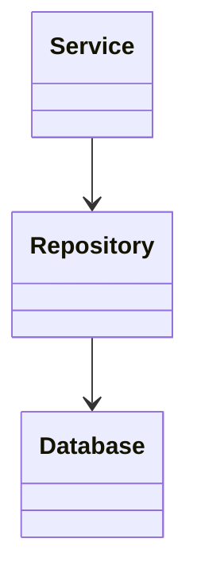

# Design_Pattern_Template.md

> **Document Version:** 1.0
> **Status:** Draft / Review / Approved
> **Owner:** Architecture Team
> **Related Requirements:** [Requirement IDs]
> **Related Architecture:** [Architecture Documents]
> **Last Updated:** YYYY-MM-DD

---

# Design Pattern Documentation

---

# Document Information

| Field | Value |
|---------|---------|
| Project | |
| Pattern Name | |
| Category | |
| Module | |
| Author | |
| Reviewer | |
| Version | |
| Status | |
| Date | |

---

# Purpose

Describe why this design pattern is used.

Include:

- Business objective
- Technical objective
- Problem being solved
- Expected benefits

---

# Scope

## Included

-

-

-

## Excluded

-

-

-

---

# Related Requirements

| ID | Description |
|----|-------------|
| BR-001 | |
| FR-001 | |
| NFR-001 | |

---

# Architecture References

Reference:

- System Architecture
- Backend Design
- API Design
- AI Component Design
- ADRs

---

# Pattern Overview

Provide a concise description.

Example

```
The Repository Pattern abstracts data access from business logic, enabling loose coupling, easier testing, and flexibility in persistence implementation.
```

---

# Pattern Category

Select one.

## Creational

- Factory Method
- Abstract Factory
- Builder
- Prototype
- Singleton

## Structural

- Adapter
- Bridge
- Composite
- Decorator
- Facade
- Flyweight
- Proxy

## Behavioral

- Strategy
- Observer
- State
- Command
- Chain of Responsibility
- Mediator
- Memento
- Template Method
- Visitor
- Iterator

## Enterprise

- Repository
- Unit of Work
- Specification
- CQRS
- Event Sourcing
- Saga
- Outbox
- Circuit Breaker
- Retry
- Bulkhead
- Dependency Injection

---

# Problem Statement

Describe the problem that necessitates this pattern.

Example

- Tight coupling
- Repeated logic
- Complex object creation
- Distributed transactions
- Resilience requirements

---

# Context

Describe the circumstances under which the pattern applies.

Include:

- System constraints
- Business drivers
- Architectural constraints

---

# Forces

Document competing concerns.

Examples

- Simplicity vs Flexibility
- Performance vs Maintainability
- Consistency vs Availability
- Coupling vs Reusability

---

# Solution

Describe the implementation approach.

Include:

- Components
- Responsibilities
- Collaboration
- Workflow

---

# Structure

Describe participating elements.

| Element | Responsibility |
|----------|----------------|
| Client | |
| Interface | |
| Concrete Class | |
| Factory | |
| Repository | |

---

# UML Diagram

Insert Mermaid or PlantUML.

## Mermaid Example



---

# Interaction Flow

Describe the runtime behavior.

Example

```
Client

↓

Service

↓

Repository

↓

Database

↓

Response
```

---

# Implementation Guidelines

Document:

- Coding standards
- Naming conventions
- Dependency rules
- Error handling
- Validation
- Thread safety (if applicable)

---

# Usage Guidelines

Describe when to use the pattern.

Examples

- Complex business logic
- Shared data access
- Dynamic behavior selection

---

# Anti-Patterns

Describe misuse.

Examples

- Overusing Singleton
- God Object
- Anemic Domain Model
- Excessive inheritance
- Circular dependencies

---

# Advantages

Document benefits.

Examples

- Loose coupling
- Improved testability
- Better maintainability
- Extensibility
- Reusability

---

# Disadvantages

Document trade-offs.

Examples

- Additional complexity
- More abstractions
- Performance overhead
- Learning curve

---

# Alternatives Considered

| Alternative | Reason Rejected |
|--------------|-----------------|
| Direct Database Access | Tight coupling |
| Static Utility Class | Poor extensibility |

---

# Dependencies

## Internal

-

-

-

## External

-

-

-

---

# Security Considerations

Document:

- Secure object creation
- Dependency validation
- Access control
- Sensitive data handling

---

# Performance Considerations

Document:

- Memory overhead
- Object lifecycle
- Caching opportunities
- Scalability impact

---

# Testability

Document:

- Unit testing approach
- Mocking strategy
- Integration testing
- Contract testing

---

# Logging

Document important events.

Examples

- Factory object creation
- Repository access
- Circuit breaker opened
- Retry executed

---

# Monitoring

Track:

- Pattern usage
- Error rates
- Performance metrics
- Retry counts
- Circuit breaker state

---

# Example Implementation

Reference:

- Source code location
- Example repository
- Sample project

---

# Risks

| Risk | Mitigation |
|------|------------|
| Pattern Overuse | Apply only where justified |
| Performance Overhead | Benchmark and optimize |

---

# Assumptions

-

-

-

---

# Constraints

-

-

-

---

# Traceability

| Requirement | Pattern |
|-------------|----------|
| FR-001 | Repository Pattern |

---

# References

- Gang of Four (GoF) Design Patterns
- Enterprise Integration Patterns
- Architecture Decision Records (ADRs)
- Project Coding Standards

---

# Review Checklist

## Pattern Selection

- [ ] Problem Clearly Defined
- [ ] Pattern Appropriate
- [ ] Alternatives Evaluated

## Implementation

- [ ] Responsibilities Assigned
- [ ] UML Diagram Included
- [ ] Usage Guidelines Defined
- [ ] Anti-Patterns Documented

## Quality

- [ ] Security Reviewed
- [ ] Performance Evaluated
- [ ] Testability Considered

## Documentation

- [ ] Requirements Linked
- [ ] Architecture References Added
- [ ] Example Implementation Referenced

## Review

- [ ] Reviewed
- [ ] Approved

---

# Revision History

| Version | Date | Description | Author |
|----------|------|-------------|--------|
| 1.0 | YYYY-MM-DD | Initial Version | |