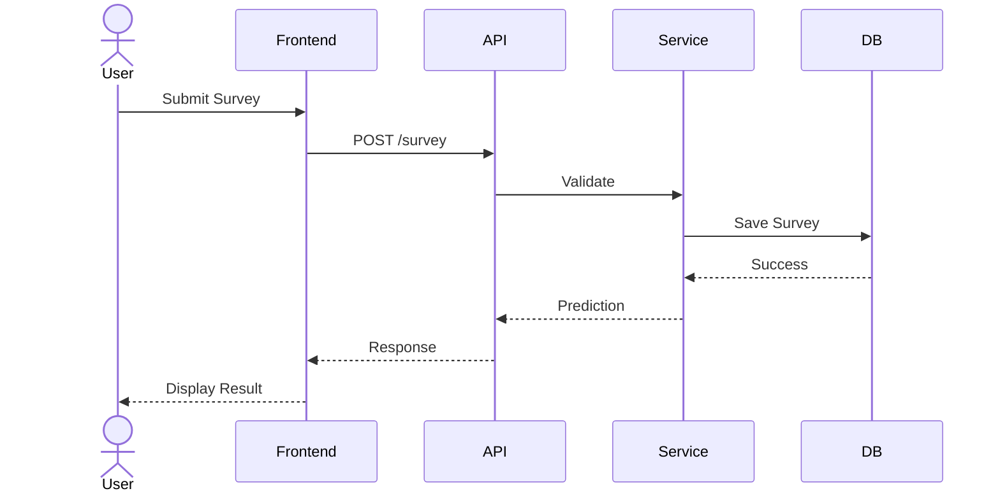

# Sequence_Diagram_Template.md

> **Document Version:** 1.0
> **Status:** Draft / Review / Approved
> **Owner:** System Design Team
> **Related Requirements:** [Requirement IDs]
> **Related Architecture:** [Architecture Documents]
> **Last Updated:** YYYY-MM-DD

---

# Sequence Diagram Design

---

# Document Information

| Field | Value |
|---------|---------|
| Project | |
| Use Case | |
| Diagram ID | |
| Author | |
| Reviewer | |
| Version | |
| Status | |
| Date | |

---

# Purpose

Describe the purpose of this sequence diagram.

Include:

- Business objective
- Technical objective
- Interaction being modeled
- Expected outcome

---

# Scope

## Included

-

-

-

## Excluded

-

-

-

---

# Related Requirements

| ID | Description |
|----|-------------|
| BR-001 | |
| FR-001 | |
| NFR-001 | |

---

# Architecture References

Reference:

- Backend Design
- Frontend Design
- API Design
- AI Design
- Security Architecture
- ADRs

---

# Scenario Description

Describe the scenario.

Example

```
Citizen submits a survey.

The backend validates it.

The AI service predicts root causes.

Recommendations are generated.

Results are returned.
```

---

# Actors

| Actor | Description |
|---------|------------|
| User | |
| Frontend | |
| API | |
| Backend | |
| AI Service | |
| Database | |

---

# Preconditions

List everything required before the interaction begins.

Example

- User authenticated
- API available
- Database reachable

---

# Postconditions

Describe expected system state.

Example

- Survey stored
- Prediction generated
- Audit log created

---

# Trigger

Describe what initiates the interaction.

Example

```
User clicks "Submit Survey"
```

---

# Main Success Flow

Describe the interaction step-by-step.

| Step | Description |
|------|-------------|
|1|User submits request|
|2|Frontend validates|
|3|API receives request|
|4|Backend processes|
|5|Database stores|
|6|AI predicts|
|7|Response returned|

---

# Alternative Flows

Document optional paths.

Example

## Invalid Input

↓

Validation Error

↓

Return 400

---

## Unauthorized

↓

401 Response

---

## AI Service Unavailable

↓

Fallback Service

↓

Cached Recommendation

---

# Exception Flows

Document unexpected failures.

Examples

- Database unavailable
- Timeout
- Network failure
- External API failure
- Queue unavailable

---

# Participants

Document every participant.

| Participant | Responsibility |
|-------------|---------------|
| User | |
| Frontend | |
| Gateway | |
| API | |
| Service | |
| Database | |

---

# Message Definitions

Document every message.

| Sender | Receiver | Message |
|---------|----------|----------|
|User|Frontend|Submit Survey|
|Frontend|API|POST /surveys|

---

# Sequence Diagram

Insert Mermaid or PlantUML.

## Mermaid Example



---

# Timing Considerations

Document:

- Expected latency
- Timeout values
- Retry policies
- Async operations

---

# Synchronization

Document:

- Synchronous calls
- Asynchronous events
- Event-driven interactions
- Queue processing

---

# Error Handling

Document:

- Validation failures
- Authentication failures
- Authorization failures
- Timeout handling
- Retry strategy
- Circuit breakers

---

# Security Considerations

Document:

- Authentication
- Authorization
- Sensitive data flow
- Encryption
- Audit logging

---

# Performance Considerations

Document:

- Network hops
- Parallel execution
- Bottlenecks
- Optimization opportunities

---

# Logging

Document key events to log.

Examples

- Request received
- Validation failed
- Prediction generated
- Timeout occurred

---

# Monitoring

Track:

- Response time
- Error rate
- Throughput
- Success rate
- Queue length

---

# Assumptions

-

-

-

---

# Constraints

-

-

-

---

# Risks

| Risk | Mitigation |
|------|------------|
| | |

---

# Traceability

| Requirement | Sequence Step |
|-------------|---------------|
| FR-001 | Step 4 |

---

# References

- Requirements
- Backend Design
- API Design
- AI Component Design
- ADRs

---

# Review Checklist

## Diagram

- [ ] Participants Identified
- [ ] Messages Complete
- [ ] Main Flow Documented
- [ ] Alternative Flows Included

## Quality

- [ ] Error Handling Included
- [ ] Security Reviewed
- [ ] Performance Considered

## Documentation

- [ ] Requirements Linked
- [ ] Architecture References Added
- [ ] Diagram Validated

## Review

- [ ] Reviewed
- [ ] Approved

---

# Revision History

| Version | Date | Description | Author |
|----------|------|-------------|--------|
| 1.0 | YYYY-MM-DD | Initial Version | |