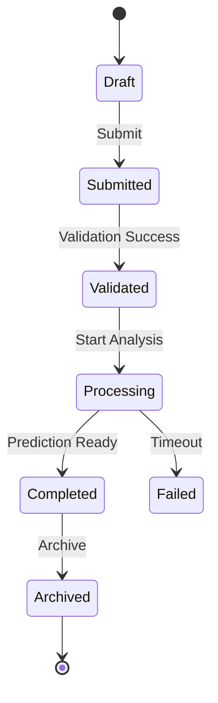

# State_Diagram_Template.md

> **Document Version:** 1.0
> **Status:** Draft / Review / Approved
> **Owner:** System Design Team
> **Related Requirements:** [Requirement IDs]
> **Related Architecture:** [Architecture Documents]
> **Last Updated:** YYYY-MM-DD

---

# State Diagram Design

---

# Document Information

| Field | Value |
|---------|---------|
| Project | |
| Module | |
| Entity / Component | |
| Diagram ID | |
| Author | |
| Reviewer | |
| Version | |
| Status | |
| Date | |

---

# Purpose

Describe the purpose of this state diagram.

Include:

- Business objective
- Technical objective
- Entity being modeled
- Lifecycle being represented

---

# Scope

## Included

-

-

-

## Excluded

-

-

-

---

# Related Requirements

| ID | Description |
|----|-------------|
| BR-001 | |
| FR-001 | |
| NFR-001 | |

---

# Architecture References

Reference:

- Backend Design
- API Design
- Database Design
- Sequence Diagram
- Activity Diagram
- ADRs

---

# Entity Overview

Describe the entity or component.

Example

```
Survey

Represents a citizen survey submitted for AI analysis.
```

---

# Lifecycle Overview

Provide a high-level lifecycle summary.

Example

```
Draft

↓

Submitted

↓

Validated

↓

Processed

↓

Completed

↓

Archived
```

---

# Initial State

Describe the starting state.

Example

```
Draft
```

---

# Final State

Describe terminal states.

Examples

- Completed
- Archived
- Cancelled
- Failed

---

# States

For every state include:

## State Name

### Description

### Entry Actions

### Exit Actions

### Allowed Events

### Business Rules

### Notes

---

# State Transitions

| From | Event | Guard | Action | To |
|------|-------|-------|--------|----|
| Draft | Submit | Validation Passed | Save Survey | Submitted |

---

# Transition Rules

Document transition constraints.

Examples

- Draft → Submitted
- Submitted → Validated
- Validated → Processed
- Processed → Completed

---

# Events

Document all triggering events.

| Event | Description |
|--------|-------------|
| Submit | |
| Validate | |
| Approve | |
| Reject | |

---

# Guards

Document conditions.

| Guard | Description |
|--------|-------------|
| Survey Complete | |
| User Authorized | |
| AI Prediction Ready | |

---

# Entry Actions

Document actions performed when entering a state.

Examples

- Create audit record
- Allocate resources
- Notify user
- Initialize timer

---

# Exit Actions

Document actions performed when leaving a state.

Examples

- Persist state
- Release resources
- Publish event

---

# Internal Actions

Document actions performed while remaining in the same state.

Examples

- Heartbeat
- Retry validation
- Refresh token
- Poll AI service

---

# State Invariants

Document conditions that must always hold true.

| State | Invariant |
|--------|-----------|
| Validated | Required fields complete |
| Completed | Prediction available |

---

# Timeout Behavior

Document timeout rules.

| State | Timeout | Action |
|--------|---------|--------|
| Processing | 5 minutes | Retry |

---

# Error States

Document failure conditions.

Examples

- Validation Failed
- AI Timeout
- Database Failure
- Authentication Failed

---

# Recovery Strategy

Document recovery mechanisms.

Examples

- Retry
- Rollback
- Manual Review
- Compensation Workflow

---

# Concurrent States

If applicable, document parallel states.

Example

```
Survey Processing

├── AI Analysis

└── Audit Logging
```

---

# State Diagram

Insert Mermaid or PlantUML.

## Mermaid Example



---

# Business Rules

| Rule ID | Description |
|----------|-------------|
| BR-001 | |

---

# Persistence

Document how state is stored.

Examples

- Database column
- Event Store
- Workflow Engine
- Cache

---

# Notifications

Document notifications sent during transitions.

Examples

- Email
- SMS
- Push Notification
- Webhook

---

# Security Considerations

Document:

- Authorization
- State transition permissions
- Audit logging
- Sensitive state handling

---

# Performance Considerations

Document:

- Transition latency
- Retry limits
- Long-running states
- Resource utilization

---

# Logging

Log:

- State entered
- State exited
- Transition executed
- Transition failed
- Timeout occurred

---

# Monitoring

Track:

- Current state distribution
- Transition frequency
- Failure rate
- Average state duration
- Retry count

---

# Dependencies

## Internal

-

-

-

## External

-

-

-

---

# Assumptions

-

-

-

---

# Constraints

-

-

-

---

# Risks

| Risk | Mitigation |
|------|------------|
| | |

---

# Traceability

| Requirement | State |
|-------------|-------|
| FR-001 | Processing |

---

# References

- Requirements
- Backend Design
- Database Design
- Sequence Diagram
- Activity Diagram
- ADRs

---

# Review Checklist

## Lifecycle

- [ ] States Identified
- [ ] Transitions Complete
- [ ] Guards Defined
- [ ] Actions Documented

## Quality

- [ ] Error States Covered
- [ ] Recovery Strategy Included
- [ ] Timeout Behavior Defined
- [ ] Business Rules Verified

## Documentation

- [ ] Diagram Validated
- [ ] Requirements Linked
- [ ] Architecture References Added

## Review

- [ ] Reviewed
- [ ] Approved

---

# Revision History

| Version | Date | Description | Author |
|----------|------|-------------|--------|
| 1.0 | YYYY-MM-DD | Initial Version | |